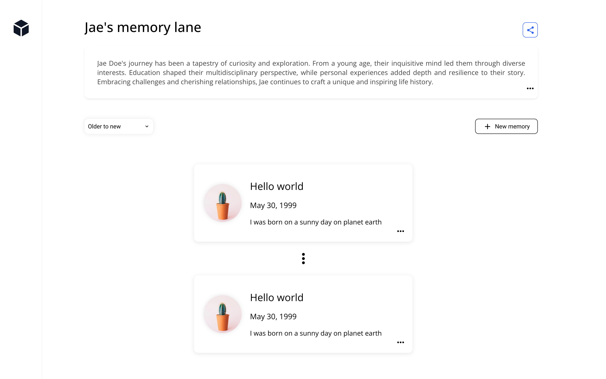

# Technical Assessment

**Please avoid initiating pull requests on this repository or forking this repository. To submit your solution, either set up a repository on your own account or forward a zip file to the appropriate contact.**

### Problem definition

After a series of discovery calls, we discovered a problem that our users face. They are having a hard time sharing their memories with friends and family. They are using a combination of social media, messaging apps, and email to share their memories. They are looking for a solution that allows them to store and share their memories in a single place.

As a first iteration for this solution, we want to build a web application that allows users to create a memory lane and share it with friends and family. A memory lane is a collection of events that happened in chronological order. Each event has a title, a description, a timestamp, and at least one image.

## Deliverables

- Clone this repository and create a new branch with your name. Open a pull request on your instance of the repository.
- An updated README providing a high-level explanation of your implementation.
- **Screenshots or a short video/gif** showing your UI implementation.
- Update the API to accommodate your technical design. Run the API by using `npm run serve:api`.
- The provided mockup is only for reference and inspiration. Feel free to improve it!

### FAQ

- **Can I add a framework like Next?** If you have the time, go for it, we want to see you use your favorite tools.
- **Is user authentication required?** No, it is not required.
- **Can I use a component library?** Yes, you can use a component library.
- **What will you be looking for?** Functionality, technical design. Responsive UI is a bonus.

**The final submission should be closer to a prototype rather than an MVP. Include improvements you might have implemented in the readme.**

### Inspiration mockup

